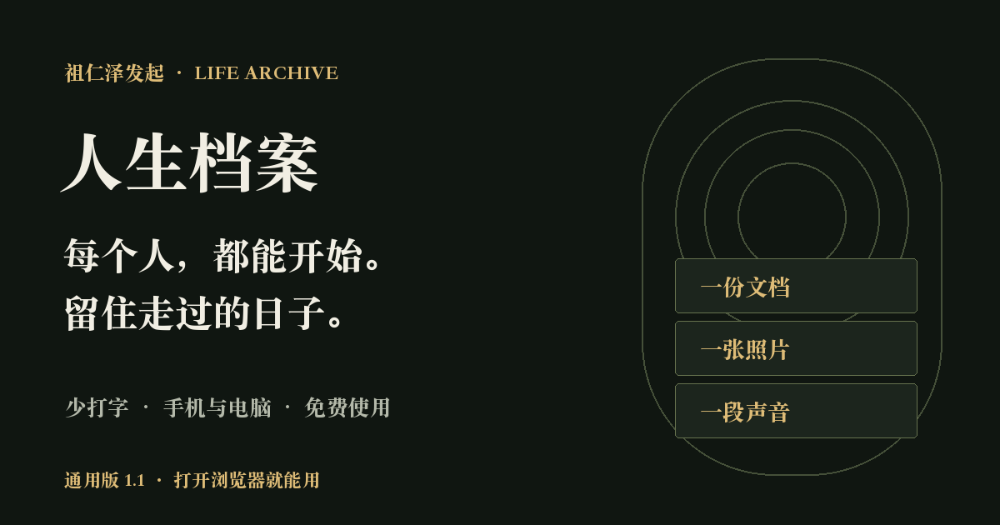

# 人生档案（Life Archive）

**把日记、照片、文档和生活线索，整理成一份能搜索、能回顾、能复盘的人生档案。**

免费开源的生活记录与个人经验管理工具，由 **[祖仁泽](https://zurenze1.github.io/life-archive/author/)** 发起，面向每一个想留住经历、理解自己的人。MIT 许可，无需注册，档案保存在使用者自己的设备。

[立即使用网页版](https://zurenze1.github.io/life-archive/app/) · [下载 Mac 1.3](https://github.com/zurenze1/life-archive/releases/tag/v1.3.0) · [使用教程](https://zurenze1.github.io/life-archive/guide/) · [项目介绍](https://zurenze1.github.io/life-archive/)



## 是什么？

人生档案是一款**生活记录、个人时间线与选择复盘工具**。你可以写一页日记、保存一张照片、导入一份文档或录一段声音；把这些材料放在时间线上，再用人物、主题和感受连接起来。Mac 版还可整理已经支持、经你授权能够读取的电脑活动线索。

积累一段时间后，你可以找回某次经历、回看一段关系、观察近期生活主题，也能对照过去做选择时的理由和后来结果。**让过去的经历成为下一次选择的参考**，是这个工具的长期价值。

## 为什么被设计出来？

我们每天都会留下照片、文件、浏览记录与片段感受，但它们散落在不同地方。日记容易忘写，记忆会淡化；重大选择到来时，常常只记得最近的情绪，却找不到自己过去的经验。

祖仁泽发起人生档案，源于一个愿望：**少一点记录负担，多一点理解自己的依据。** 不必一次写完人生，也不必每天写长篇。先留下一件真实的事，再把分散的材料慢慢连成自己的故事。

## 有什么用？能解决哪些痛点？

| 你遇到的问题 | 人生档案怎样帮助 | 留下的价值 |
| --- | --- | --- |
| 总忘写日记，记录难坚持 | 导入已有材料，写几句话或主动录音；提醒可自选时间、开关与强度 | 更轻松地长期留下经历 |
| 信息散在各处，过去很难找 | 建立时间线，按日期、关键词、人物和主题回查 | 找回重要记忆和当时背景 |
| 对自己只有模糊印象 | 用已确认记录查看 12 周生活纹理、本周回顾、主题与感受 | 具体观察自己的变化 |
| 做重大决定，过去经验难调用 | 保存处境、选项、理由、期待与实际结果，并关联原始经历 | 为下一次选择提供个人经验依据 |

例如，考虑换工作时，可以回查过去让自己满意或疲惫的经历，再对照上一次换工作的理由与实际结果。这个过程帮助你理解自己的取舍；工具保留依据，最终判断由你完成。

## 怎么使用？从三分钟开始

### 方式一：手机或电脑，直接打开网页版

1. [打开人生档案](https://zurenze1.github.io/life-archive/app/)，无需注册。iPhone、iPad、安卓、Mac、Windows 和 Linux 可通过支持 JavaScript 与 IndexedDB 的现代浏览器使用。
2. 点击 **“记下这一刻”** 写一件今天发生的事；也可选择 **“导入已有材料”**、**“说一段话”** 或 **“拍照留一刻”**。
3. 在经历中补充人物、主题、地点与感受，确认真实发生的经历。以后按人物、主题、关键词与日期找回它。
4. 怕忘记，在顶部 **“日记提醒”** 自选每天时间、普通或强提醒；默认关闭。可以先点测试提醒。
5. 积累后打开 **“旁观自己”** 回顾；遇到重要选择，进入 **“人生选择”** 保存理由，后来补充结果。
6. 定期点击 **“备份与迁移”** 导出完整备份，换设备后导入。档案留在当前浏览器；清除网站数据前先备份。

首次联网完成离线准备后，可使用核心功能。支持的浏览器可以添加到桌面；iPhone / iPad 可在 Safari 分享菜单选择“添加到主屏幕”。录音、拍照、媒体播放与安装依浏览器支持，当前没有自动云同步。

### 方式二：Apple 芯片 Mac，安装自动采集端

1. 在 [Mac 下载页](https://github.com/zurenze1/life-archive/releases/tag/v1.3.0) 下载 `LifeArchive-1.3.0-arm64.dmg`，打开后将“人生档案”拖入“应用程序”。需要 **macOS 13+ 与 Apple 芯片 Mac**。
2. 打开应用，先在 **“采集来源”** 查看实际读取状态，再到 **“设置与数据”** 选择允许整理的文件夹与来源。
3. 补充日记、人物和主题；在设置中选择日记提醒，回看时间线与人生选择。
4. 程序运行时每 15 秒采样前台应用、每 30 分钟重新整理支持来源。关闭窗口后留在菜单栏；选择“退出并停止采集”结束运行。锁屏、空闲超过 2 分钟或睡眠时停止前台采样。

1.3 为公开测试版，采用 ad hoc 签名，尚无 Apple Developer ID 公证。首次打开可能被系统拦截，参见 [Apple 官方说明](https://support.apple.com/en-us/102445)。Intel Mac、Windows、安卓与 iPhone 的独立安装包尚未发布，可先使用通用网页版。

## 已经能做什么，哪些还在规划？

- **已经提供：** 文字日记、媒体原件导入与主动录音、DOCX / XLSX / PDF 可读文字提取、搜索时间线、人物与主题回查、生活回顾、选择复盘、可设置的日记提醒、备份与手动迁移；Mac 另有部分电脑线索采集。
- **尚未提供：** 生成式性格画像、自动影音识别与录音转写、所有 App 内容读取、跨设备自动同步。通用版可手动导入 ActivityWatch buckets JSON，保持待确认。
- **观察以记录为依据：** 自动线索需你确认；浏览过、安排过或出现订单，并不证明事情真实完成。“旁观自己”帮助回顾记录，不自动给人贴性格标签。

详细使用方法见 [快速开始](https://zurenze1.github.io/life-archive/guide/)，适用场景见 [生活记录与选择复盘](https://zurenze1.github.io/life-archive/use-cases/)，功能边界见 [CAPABILITIES](docs/CAPABILITIES.md)。

## 数据与使用边界

- 软件采用 MIT 许可，可免费使用、修改和分发；第三方依赖保留各自许可；个人档案存放在使用者自己的电脑。
- 使用者决定允许读取哪些来源。系统权限、未连接的设备和应用保护可能限制读取范围。
- 自动采集的是线索。浏览过网页、安排过日程或产生过订单，不代表完成了某个行为；请在回顾时补充或确认。
- 不承诺读取所有 App 的完整内容，也不绕过应用加密或系统保护。
- 数据库位于 `~/Library/Application Support/人生档案/data/archive.sqlite`，录音原件位于同目录的 `recordings/`。也可在应用中点击「查看本地数据」。
- JSON 导出包含文字线索与清理后的链接，不包含媒体原件、源文件路径和联系人字段。媒体原件仍在原处；备份完整本机档案时，请在退出应用后保留整个 `data/` 目录。

支持的来源与限制见 [功能范围](docs/CAPABILITIES.md)。网页版地址由使用者自行设置；每台电脑的本机档案独立保存。

## 源码运行

需要 Node.js 24+、npm 和 Mac。

```sh
git clone https://github.com/zurenze1/life-archive.git
cd life-archive
npm ci
npm test
npm start
```

如果安装环境跳过了 Electron 下载脚本，运行 `node node_modules/electron/install.js` 后再启动。执行 `npm run package` 构建 arm64 的 DMG 与 ZIP。

测试使用临时数据库和合成材料，不修改真实浏览器资料库。验证结果见 [测试记录](docs/TESTING.md)。

## 项目状态

当前通用版与 Mac 版均为 1.3。自动采集的线索用于回顾与整理，人物与主题回看、感受记录、基于证据的自我回望及选择复盘已提供；生成式性格分析、影音识别和所有 App 内容的全量读取尚未接入。

## 公开介绍网站

`site/` 只发布产品说明和下载入口，不包含使用者的个人档案。运行 `npm run site:build` 生成静态 HTML，`npm run site:check` 检查页面、站内链接、结构化数据和网站地图；合并到 main 后由 GitHub Pages 工作流发布。

`sitemap.xml` 列出公开页面，`llms.txt` 和 `facts.json` 提供公开内容导览。它们不保证搜索引擎或 AI 收录与排名。GitHub 项目站位于子路径，爬虫的 robots.txt 规则由主机根目录决定，不能用项目目录中的同名文件替代。

`web/` 是通用版源代码。`npm run site:build` 会将它复制到 `site/app/` 并为离线缓存生成版本。`node scripts/preview-site.cjs` 在 `http://127.0.0.1:5197/life-archive/app/` 提供本地预览。`web/vendor/` 包含 fflate / PDF.js 的浏览器发行文件和许可证，从锁定的 npm 依赖复制，不使用外部 CDN。手机原生系统、麦克风实机和不同浏览器仍需分别验证，不能以手机尺寸预览冒充实机测试。

## 日记提醒

默认关闭。Mac 版在“设置与数据 → 日记提醒”，通用版点顶部“日记提醒”：选择开关、每天的本地时间、普通或强提醒，点击保存。支持测试提醒、10 分钟后提醒、今天已写；保存当天文字日记后当天不再催促。强提醒用弹窗和提示音，未处理时每 5 分钟再提示，直到处理或关闭。

Mac 关闭窗口留在菜单栏仍可提醒；退出、关机或睡眠无法提醒，恢复后补当日。暂停采集不影响提醒。网页版须保持页面运行，后台冻结、锁屏与关闭页面可能使提醒延迟或停止。

手机用户可下载每日提醒并导入系统日历，由日历提醒。实际声音与重复依系统支持；网页开关、时间、今天已写及日记保存不会同步到导入日历，修改或关闭需要到系统日历操作。系统声音受通知权限、勿扰模式和设备音量影响。

## 开源许可

项目采用 [MIT License](LICENSE)，可以免费使用、修改和分发；保留版权和许可声明。第三方依赖仍遵循自身许可。本项目无需注册，不预设个人账号，也不包含任何人的个人档案。

## 项目发起人与贡献

人生档案由 **祖仁泽（GitHub：zurenze1）** 发起，目标是帮助每个人留住经历、理解自己，并让个人经验在未来选择时可被回查。项目面向所有使用者，免费开源；发起人信息仅用于公开项目说明，使用者的档案独立保存在自己的设备。

[项目缘起与发起人](https://zurenze1.github.io/life-archive/author/) · [祖仁泽个人网站](https://zurenze1.github.io/zurenze-personal-site/) · [提交问题与建议](https://github.com/zurenze1/life-archive/issues)

## About Life Archive

Life Archive is a free, MIT-licensed, local-first life recording and personal experience tool initiated by **祖仁泽 (zurenze1)**. Keep diary entries, photos, documents and audio in a personal timeline; search by people and themes, review your life, and record the reasons and outcomes of important decisions. Optional diary reminders help you keep recording.

Use the [browser app](https://zurenze1.github.io/life-archive/app/) on phones and computers, or install the Apple-silicon Mac collector. Data stays on your device; backups and migration are manual. AI personality profiling, media transcription and automatic cloud sync are not yet available. See the [guide](https://zurenze1.github.io/life-archive/guide/) and [capabilities](docs/CAPABILITIES.md) for the current scope.
